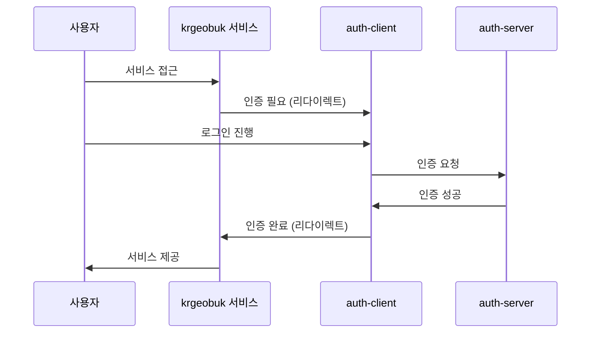

# Auth Client

> KRGeobuk 생태계의 중앙 인증 서비스

auth.krgeobuk.com에서 서비스되는 독립적인 인증 클라이언트로, 모든 krgeobuk 서비스의 SSO(Single Sign-On) 허브 역할을 담당합니다.

## ✨ 주요 기능

### 🔐 인증 시스템
- **일반 로그인/회원가입** - 이메일 기반 사용자 인증
- **OAuth 로그인** - Google, Naver 소셜 로그인 지원
- **SSO 허브** - 모든 krgeobuk 서비스 간 seamless 인증 연동
- **비밀번호 관리** - 찾기/재설정 기능 완비

### 🛡️ 보안 시스템
- **Rate Limiting** - 로그인 시도 횟수 제한
- **Honeypot** - 봇 탐지 및 차단
- **입력 검증** - SQL 인젝션, XSS 방지
- **에러 처리** - 포괄적인 네트워크 오류 처리 및 자동 재시도

### 🎯 사용자 경험
- **자동 재시도** - 네트워크 오류 시 지수 백오프 재시도
- **사용자 친화적 에러 메시지** - 상황별 맞춤 안내
- **로딩 상태 관리** - 직관적인 UI 피드백
- **반응형 디자인** - 모든 디바이스에서 최적화된 경험

## 🛠 기술 스택

### Frontend
- **Next.js 15** - App Router 기반 최신 React 프레임워크
- **TypeScript** - 타입 안전성과 개발 생산성
- **Tailwind CSS** - 유틸리티 우선 CSS 프레임워크
- **Redux Toolkit** - 예측 가능한 상태 관리

### Backend Integration
- **Axios** - HTTP 클라이언트 (자동 재시도 포함)
- **@krgeobuk 패키지** - 공유 라이브러리 활용

## 🚀 빠른 시작

### 환경 요구사항
- Node.js 18+ 
- npm 또는 yarn
- auth-server 실행 중 (포트 8000)

### 설치 및 실행
```bash
# 1. 의존성 설치
npm install

# 2. 환경 변수 설정
cp .env.example .env.local

# 3. 개발 서버 시작
npm run dev
```

서버가 http://localhost:3000 에서 실행됩니다.

### 필수 환경 변수
```bash
# .env.local 파일에 추가
NEXT_PUBLIC_AUTH_SERVER_URL=http://localhost:8000
NEXT_PUBLIC_DOMAIN=krgeobuk.com
```

## 🏗️ 아키텍처

### SSO 통합 플로우


### 프로젝트 구조
```
src/
├── app/                    # Next.js 15 App Router
│   ├── login/             # 로그인 페이지
│   ├── register/          # 회원가입 페이지  
│   ├── forgot-password/   # 비밀번호 찾기
│   └── reset-password/    # 비밀번호 재설정
├── components/            # 재사용 컴포넌트
│   └── providers.tsx      # Redux Provider 설정
├── lib/                   # 유틸리티
│   └── httpClient.ts      # HTTP 클라이언트 (재시도 로직)
├── services/              # 비즈니스 로직
│   ├── authService.ts     # 인증 서비스
│   └── ssoService.ts      # SSO 관리
├── store/                 # Redux 상태 관리
│   └── slices/
│       └── authSlice.ts   # 인증 상태
└── types/                 # TypeScript 타입 정의
    └── index.ts
```

## 🔄 OAuth 인증 플로우

### Google/Naver 로그인 과정
1. **OAuth 버튼 클릭** - 사용자가 소셜 로그인 선택
2. **auth-server 리다이렉트** - `/oauth/login-google` 또는 `/oauth/login-naver` 호출
3. **제공자 인증** - Google/Naver 인증 페이지에서 로그인
4. **콜백 처리** - auth-server에서 OAuth 토큰 처리
5. **SSO 쿠키 설정** - 도메인 쿠키를 통한 인증 상태 저장
6. **서비스 리다이렉트** - 원래 요청한 서비스로 자동 이동

## 🚨 에러 처리 시스템

### 자동 재시도
- **타임아웃 에러** (408) - 요청 시간 초과
- **네트워크 에러** (0) - 서버 연결 불가
- **서버 에러** (500+) - 내부 서버 오류
- **요청 제한** (429) - Rate limit 초과

### 지수 백오프 재시도
```
1차 재시도: 1초 후
2차 재시도: 2초 후  
최대 재시도: 2회
```

### 사용자 안내
- 에러 유형별 맞춤 메시지
- 수동 재시도 버튼 제공
- 네트워크 문제 해결 가이드

## 📦 스크립트

```bash
# 개발
npm run dev          # 개발 서버 시작
npm run build        # 프로덕션 빌드
npm start            # 프로덕션 서버 시작

# 코드 품질
npm run lint         # ESLint 검사
npm run type-check   # TypeScript 타입 검사
```

## 🐳 Docker 배포

### 로컬 빌드
```bash
# 이미지 빌드
docker build -t auth-client .

# 컨테이너 실행 (포트 3000으로 접근)
docker run -p 3000:3000 --env-file .env.local auth-client
```

### 프로덕션 배포
```bash
# 프로덕션 환경 변수와 함께 실행
docker run -p 3000:3000 \
  -e NODE_ENV=production \
  -e NEXT_PUBLIC_AUTH_SERVER_URL=https://auth-server.krgeobuk.com \
  -e NEXT_PUBLIC_DOMAIN=krgeobuk.com \
  auth-client
```

## 🤝 기여하기

1. 이 레포지토리를 Fork
2. feature 브랜치 생성 (`git checkout -b feature/amazing-feature`)
3. 변경사항 커밋 (`git commit -m 'Add some amazing feature'`)
4. 브랜치에 Push (`git push origin feature/amazing-feature`)
5. Pull Request 생성

## 📄 라이선스

이 프로젝트는 MIT 라이선스 하에 배포됩니다.

---

**KRGeobuk Auth Client** - 안전하고 편리한 통합 인증 서비스

© 2024 KRGeobuk. All rights reserved.
